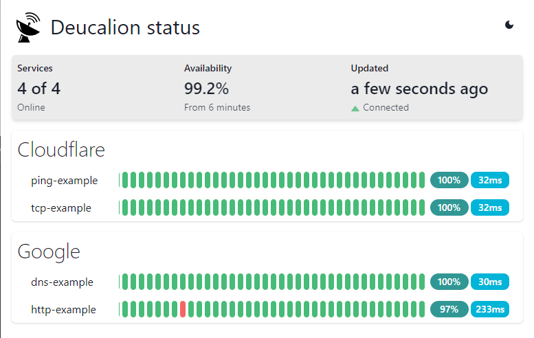

# Deucalion

Minimal project for systems monitoring. When Grafana + Prometheus is overkill.

This is not a "Status Page" project. There is no intention to add alerts, incidents history, push notifications, or CRUD UIs to configure everything. 

Just put up a simple configuration file, start the service, and you are done.




# Usage

For a quick start:

```yaml
# docker-compose.yaml
version: "3.9"

services:
  deucalion:
    container_name: deucalion
    image: ghcr.io/fdcastel/deucalion:latest
    ports:
     - 80:80
    environment:
      - DEUCALION__PAGETITLE=Deucalion status
    volumes:
      - ./example.yaml:/app/deucalion.yaml
      - ./data/:/storage/
```

```yaml
# example.yaml
monitors:
  ping-example:
    !ping
    host: cloudflare.com
    intervalWhenUp: 00:00:03
    group: Cloudflare

  tcp-example:
    !tcp
    host: cloudflare.com
    port: 443
    intervalWhenUp: 00:00:03
    group: Cloudflare
    
  dns-example:
    !dns
    host: google.com
    recordType: A
    resolver: 1.1.1.1:53
    intervalWhenUp: 00:00:03
    group: Google

  http-example:
    !http
    url: https://google.com
    expectedStatusCode: 200
    expectedResponseBodyPattern: .*
    ignoreCertificateErrors: true
    intervalWhenUp: 00:00:03
    group: Google
```


# Development notes

## Project guidelines:
  - Configuration files over CRUD forms
  - [Hexagonal Architecture](https://en.wikipedia.org/wiki/Hexagonal_architecture_(software))
  - [K.I.S.S.](https://en.wikipedia.org/wiki/KISS_principle)
  - [Do One Thing And Do It Well](https://en.wikipedia.org/wiki/Unix_philosophy): Not a "Status Page" (with incidents, justifications, etc)

## How to debug

Open `Deucalion.sln` with Visual Studio 2022. 

Start both `Deucalion.Api` and `deucalion-ui` projects. Solution is already configured to start both projects on `F5`.

Do not use `Deucalion.Service` for debugging. It uses a static (pre-built) version of UI (you should run `Invoke-Build` first).

## How to build

Install [`Invoke-Build`](https://github.com/nightroman/Invoke-Build).

`Invoke-Build`  or `Invoke-Build build` will put all artifacts in `./publish` folder.

`Invoke-Build test` will build and start a production version using `./deucalion-sample.yaml` configuration.

 To build docker images use `docker-compose build`.
 